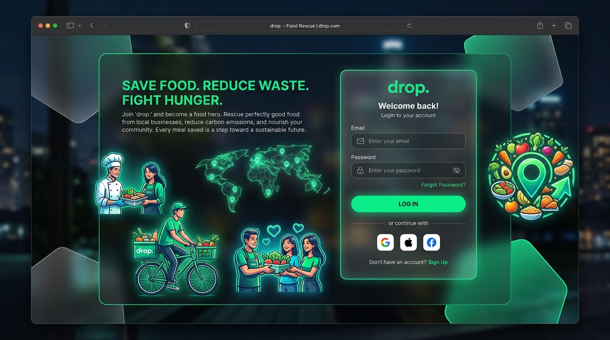
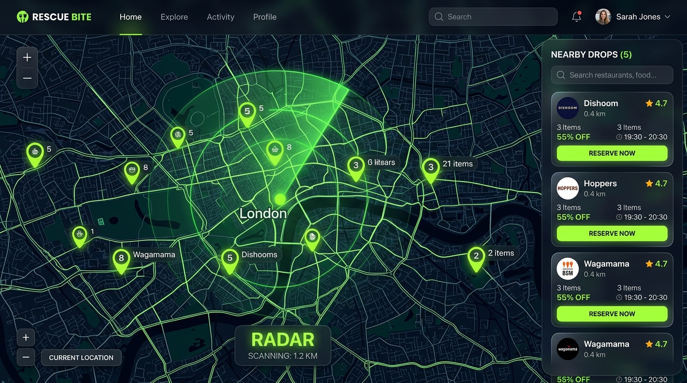
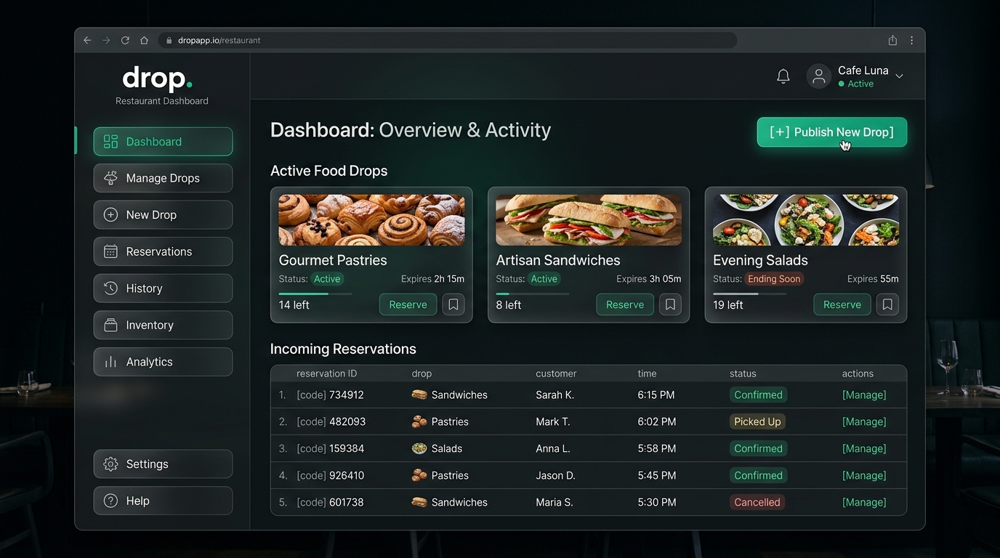
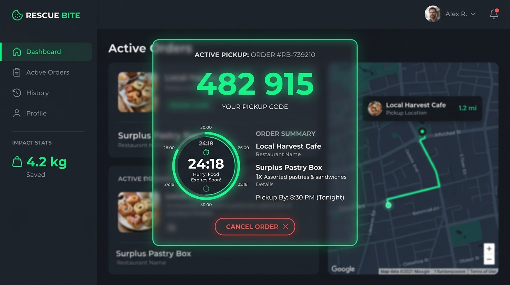
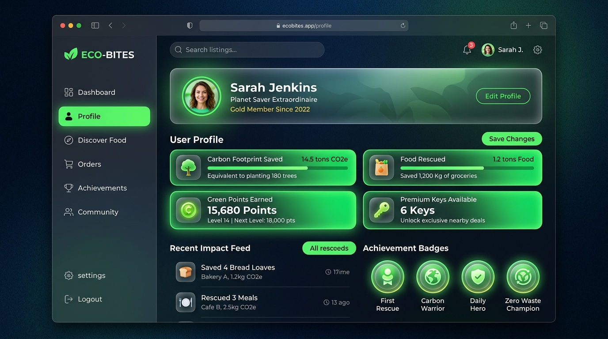
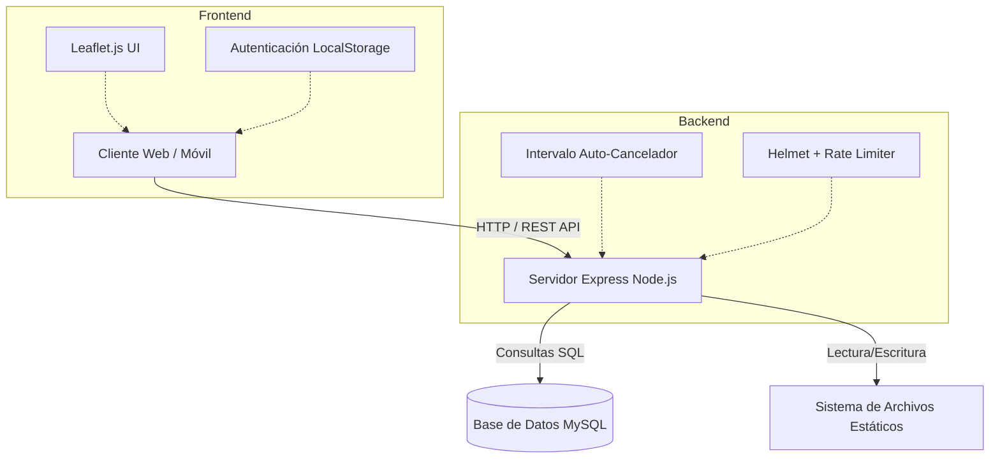
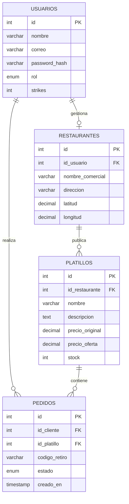
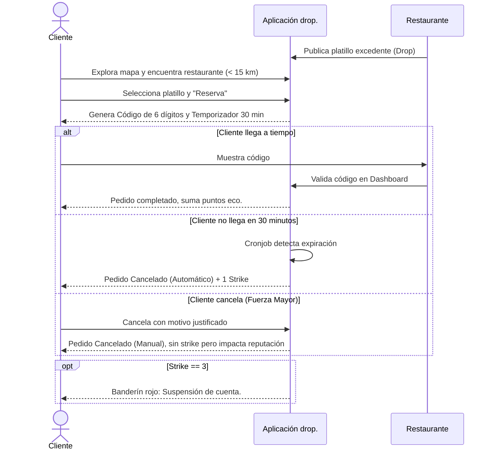

# drop. - Plataforma de Rescate Gastronómico en Cd. Victoria

**drop.** es una aplicación comunitaria innovadora diseñada para combatir el desperdicio de alimentos en Ciudad Victoria, Tamaulipas. Conecta establecimientos locales (restaurantes, panaderías, fondas) con usuarios que desean rescatar platillos en perfecto estado a precios preferenciales al finalizar los turnos.

---

## 📸 Mockups de la Interfaz

La aplicación cuenta con un diseño *glassmorphism* fluido, temas oscuros y acentos en verde esmeralda neón (`#00e676`), para brindar una experiencia *premium* y ecológica.

| Inicio de Sesión y Registro | Mapa y Exploración | Dashboard de Restaurantes |
|:---:|:---:|:---:|
|  |  |  |
| Diseño limpio y amigable. | Geolocalización de restaurantes. | Gestión de inventario rescatable. |

| Pedido Activo (Temporizador) | Perfil y Gamificación |
|:---:|:---:|
|  |  |
| Cuenta regresiva de 30 mins y código. | Huella de carbono y strikes. |

---

## 🛠️ Pila Tecnológica (Tech Stack)

* **Frontend:** HTML5, CSS3 (Vanilla + Custom Properties para Glassmorphism), JavaScript (Vanilla JS).
* **Mapas y Geolocalización:** Leaflet.js con OpenStreetMap.
* **Backend:** Node.js, Express.js.
* **Base de Datos:** MySQL (MySQL 8.4) con pool de conexiones.
* **Seguridad y Autenticación:** JSON Web Tokens (JWT), bcryptjs, Helmet, Express Rate Limit.
* **Manejo de Tareas Background:** Sistema interno de validación de temporizadores para cancelaciones automáticas.

---

## 🏗️ Arquitectura del Sistema

El sistema utiliza una arquitectura Cliente-Servidor clásica mediante API RESTful. El frontend está completamente desacoplado lógicamente pero servido por el mismo servidor web (Express Static) para simplificar el despliegue.

---

## 📊 Diagrama Entidad-Relación (ER)

El modelo de datos relacional asegura la integridad y trazabilidad de cada "Drop" (porción de comida rescatada).

---

## 🔄 Flujo de Usuario (Customer Journey)

El ciclo de vida de un rescate gastronómico está diseñado para ser rápido, seguro y evitar abusos mediante el sistema de "3 Strikes".

---

## 🛡️ Mecanismos de Seguridad y Lógica de Negocio

### 1. Tolerancia a Fallos y Concurrencia
Para los pedidos concurrentes (ej. un maestro intentando saturar el servidor pidiendo el mismo platillo que tiene `stock = 1`), la base de datos MySQL utiliza bloqueos de fila y transacciones ACID. La lógica del backend envuelve la reserva en un bloque `try-catch` y transaccional `CONNECTION.beginTransaction()`.

### 2. Sistema de Strikes
Diseñado para la formalidad y viabilidad comercial de los restaurantes:
- Cada pedido abandonado suma **1 Strike**.
- Acumular **3 Strikes** bloquea la cuenta del usuario para futuros pedidos (se requiere intervención manual o paso de tiempo según políticas).

### 3. Temporizador y Cancelaciones Automáticas
El servidor cuenta con un `setInterval` que corre cada minuto. Escanea la tabla `pedidos` buscando registros en estado `'activo'` cuya diferencia entre `NOW()` y `creado_en` sea superior a 30 minutos. Estos pedidos se cancelan automáticamente y se repone el stock.

---

*Documentación generada automáticamente para el proyecto `drop.` - Ciudad Victoria, Tamaulipas.*
